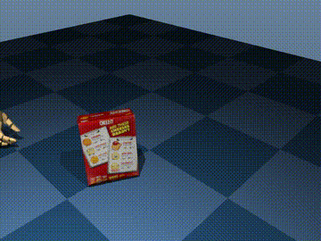
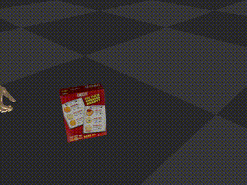
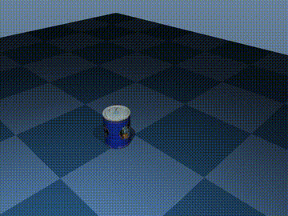
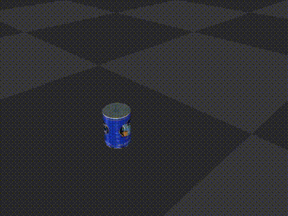
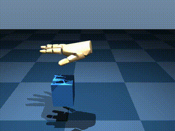
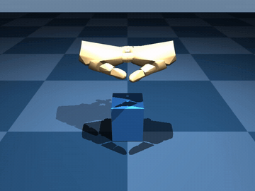
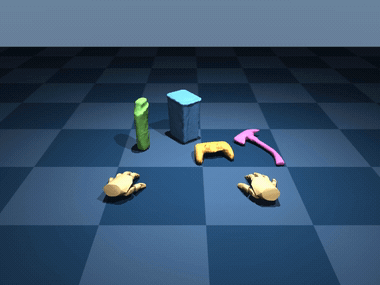
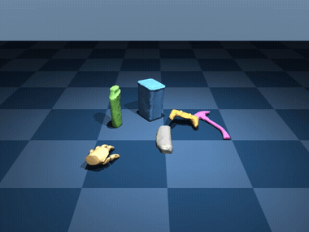
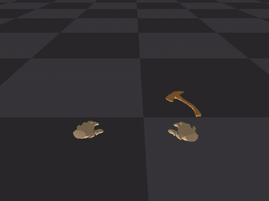

# DexHOI2Sim

Drop a **hand-object interaction** (MANO hand + object CAD) into a physics
simulator and measure whether it holds up. Built to benchmark **HOI-generation**
methods: take a generated grasp/manipulation, replicate it in **MuJoCo** and
**IsaacGym**, and get back **success-rate** and **physical-plausibility** metrics
— not just a pretty video.

The hand is the **MANO2URDF 45-DOF hand**: the real MANO mesh partitioned into 16
links, driven by joint angles computed **analytically** from the MANO pose (no
retargeting optimization). Verified to reproduce MANO to **~0.02 mm** (joints) /
**~1.5 mm** (vertices).

### Example A — DexYCB `20200709-subject-01 / 20200709_142211` (003_cracker_box)

| MuJoCo — kinematic | MuJoCo — physics | IsaacGym — physics |
|:--:|:--:|:--:|
|  |  |  |
| box follows the hand (exact replay) | hand knocks the box — grasp fails | same, in IsaacGym |

### Example B — DexYCB `20200709-subject-01 / 20200709_141754` (002_master_chef_can)

| MuJoCo — kinematic | MuJoCo — physics | IsaacGym — physics |
|:--:|:--:|:--:|
|  |  |  |
| hand grasps + lifts the can | can not held — grasp fails | same, in IsaacGym |

Kinematic replays the recorded motion exactly; **physics** reveals that this naive
replay does *not* actually hold the object (`grasp_success: false`, see below) — a
useful signal when benchmarking HOI-generation methods.

> The hand is **shaped by the MANO β (shape) parameter**: `generate_urdf.py` builds
> the URDF mesh from each subject's `betas`, so a different subject → a differently
> sized/shaped hand. The URDF is regenerated per β.

---

## Install

```bash
conda env create -f environment.yml && conda activate dexhoi2sim
# or:  pip install -r requirements.txt

# MANO models (register, non-commercial): put MANO_RIGHT.pkl / MANO_LEFT.pkl in
#   mano2urdf/assets/            # https://mano.is.tue.mpg.de
# DexYCB (register): download to /root/data/dexycb  # https://dex-ycb.github.io
```

IsaacGym is an **optional** backend (Preview 4, manual install). MuJoCo works out
of the box. Headless rendering uses EGL — set `MUJOCO_GL=egl MUJOCO_EGL_DEVICE_ID=0`
(the CLI does this for you).

## Run

One command builds the hand URDF, computes per-frame joint angles, simulates, and
evaluates:

```bash
python replicate.py \
    --subject 20200709-subject-01 --session 20200709_142211 \
    --backend both --mode physics --render --eval \
    --out-dir out/142211
```

Outputs in `out/142211/`: `mujoco_physics.mp4`, `isaac_physics.mp4`, and
`metrics.json`:

```json
{
  "object": "003_cracker_box",
  "n_frames": 71,
  "object_traj_error_mm": 99.06,    // mean object position error, sim vs reference
  "final_error_mm": 222.24,         // error at the last frame
  "grasp_success": false            // final error < 50 mm -> object tracked its path
}
```

Flags: `--backend mujoco|isaac|both`, `--mode kinematic|physics`,
`--render/--no-render`, `--eval`.

## Custom (non-DexYCB) data — one bundle file

Bring your own MANO hand + object (e.g. an HOI-generation model's output) as a
**single bundle** (`.npz` or `.pkl` holding a dict):

```bash
python replicate.py --bundle my_hoi.npz \
    --backend both --mode physics --render --eval --out-dir out/custom
```

There's a ready-to-run synthetic example (a hand grasping a box — no dataset assets):

```bash
python examples/make_sample_bundle.py           # writes examples/sample.npz
python replicate.py --bundle examples/sample.npz --mode physics --render --eval \
    --out-dir out/sample
```



### Bundle keys

| key | shape | meaning |
|---|---|---|
| `betas` | (10,) | MANO shape parameter (β) — the hand is built from this |
| `hand_pose` | (T,48) | MANO **axis-angle** [global(3) + 45 finger], **not PCA** |
| `trans` | (T,3) | wrist translation |
| `side` | str | `"right"` / `"left"` (optional) |
| `object_poses` | (T,7) | `[x,y,z, qw,qx,qy,qz]` per frame |
| `object_verts` + `object_faces` | (V,3)+(F,3) | embedded object mesh … |
| `object_mesh` | str | … *or* a path to a mesh file instead |
| `object_color` | (3,) | solid RGB (optional; custom CAD has no texture) |

**Conventions:** everything is in one **Z-up world frame** (gravity `-Z`, table
`z=0`). Hand pose is **full axis-angle** — if yours is PCA, expand it with
`hands_mean + pca @ hands_components` from the MANO pkl. (DexYCB's +Y-down camera
frame is converted internally; for custom data *you* supply the upright frame.)

You can also pass the pieces individually instead of a bundle: `--custom
--betas-yml … --poses … --trans … --object-cad … --object-poses …`.

### Two hands (custom bimanual)

For a two-hand interaction, put a **`hands` list** in the bundle instead of the flat
`betas`/`hand_pose`/`trans`/`side` keys — each entry has that hand's `betas`,
`hand_pose (T,48)`, `trans (T,3)`, and `side` (the object keys stay shared):

```python
bundle = {"hands": [ {"betas": …, "hand_pose": …, "trans": …, "side": "right"},
                     {"betas": …, "hand_pose": …, "trans": …, "side": "left"} ],
          "object_mesh": "obj.obj", "object_poses": …, "object_color": [.2,.5,.85]}
```

Ready-to-run synthetic example (two hands grasping a box):

```bash
python examples/make_sample_bundle_twohands.py     # writes examples/sample_twohands.npz
python replicate.py --bundle examples/sample_twohands.npz --backend both \
    --mode kinematic --out-dir out/sample_two
```



Or pass a second hand on the command line: add `--poses2 … --trans2 … [--left2]
[--betas-yml2 …]` to the `--custom` form (the 2nd hand reuses `--betas-yml` if you
omit `--betas-yml2`). The desk height is auto-inferred from the object's resting
pose and the camera frames both hands. The trajectory metric (`--eval`) is
single-hand only, so bimanual runs render but skip scoring.

## HO-Cap — two hands, three interactions

[HO-Cap](https://irvlutd.github.io/HOCap/) sessions replay directly, including
**bimanual** ones. One flag drives all three task types (the loader picks up 1 or
2 hands and the manipulated object automatically):

```bash
# handover (two hands pass the object)
python replicate.py --hocap --subject subject_2 --session 20231022_200657 \
    --backend both --mode kinematic --out-dir out/handover

# pick-and-place / affordance-use are single-hand sessions — same command
python replicate.py --hocap --subject subject_2 --session 20231022_201316 \
    --backend mujoco --out-dir out/pickplace          # task 1
python replicate.py --hocap --subject subject_2 --session 20231022_201556 \
    --backend mujoco --out-dir out/affordance         # task 3
```

Bimanual **handover** (`subject_2 / 20231022_200657`, object `G07_4`) — both hands
replicated in one shared Z-up world; the desk height is inferred from the object's
resting pose so it sits on the table instead of falling:

| MuJoCo — kinematic | MuJoCo — physics | IsaacGym — kinematic |
| --- | --- | --- |
|  |  |  |

Of HO-Cap's three tasks only **handover** is genuinely two-handed; pick-and-place
and affordance-use are single-hand (the other hand rests ~1.7 m away), so the loader
replicates those with one hand.

HO-Cap uses the **same manopth PCA basis as DexYCB**, so the loader
(`sim/hocap_loader.py`) reads betas from `calibration/mano/<subject>.yaml`, expands
the PCA straight from the MANO pkl, and takes object CAD from
`models/<id>/textured_mesh.obj` — no manopth dependency. Objects carry their HO-Cap
texture in IsaacGym; MuJoCo shades them a solid color. You only need the (small)
`models/`, `calibration/` and per-session pose folders — the multi-GB RGB-D is not
required to replicate. The sim frame is already Z-up, so no camera→world transform.

`grasp_success` / the trajectory metric are **single-hand only** for now; bimanual
sessions render but skip `--eval`.

## Metric — does the object follow its intended trajectory?

The one thing that matters: **when the hand executes the generated motion in
physics, does the object go where it's supposed to?** We roll the sequence out
under gravity + contact — the hand PD-tracks the reference joint trajectory, the
object is a free rigid body — and compare the object's *simulated* path to the
*given* (recorded) object trajectory. A good grasp carries the object along its
reference path (small error → `grasp_success`); a failed grasp lets it stay, slip,
or fall (large error). Naive replay of a kinematic reference typically fails here
— which is exactly what makes this a useful benchmark for HOI-generation methods.

## Hand model

The hand is **MANO2URDF (45-DOF, analytic)** — the real MANO mesh split into 16
links, driven by joint angles computed directly from the MANO pose (no IK, no
optimization). Both single-hand (DexYCB/custom) and two-hand (HO-Cap) sequences
use it; a bimanual scene is just two of these hands in one shared world frame.

## Repo layout

```
replicate.py                     # CLI: build -> simulate -> evaluate (DexYCB / --bundle / --hocap)
examples/make_sample_bundle.py   # writes a synthetic sample.npz you can run
mano2urdf/
  scripts/generate_urdf.py       #  beta -> hand URDF + 16 MANO link meshes
  scripts/pose_to_joint_angles.py#  seq -> per-frame 51-DOF qpos (analytic)
  scripts/verify_vertex_error.py #  URDF-FK vs MANO-LBS check
  mano2urdf/                     #  URDF generator (adapted from ArtiGrasp)
  assets/                        #  MANO_*.pkl  (you provide)
sim/
  mano2urdf_mujoco.py            #  MuJoCo backend (kinematic + physics)
  mano2urdf_isaac.py             #  IsaacGym backend (kinematic + physics)
  metrics.py                     #  object trajectory tracking (sim vs reference)
  verify_mujoco_fk.py            #  MuJoCo-FK vs MANO joint check
  dexycb_loader.py, dexycb_world.py  # DexYCB seq loading + master->tag(Z-up) frame
  hocap_loader.py                #  HO-Cap session -> hands + objects (bimanual)
```

## Key facts (so you don't re-derive them)

- **DexYCB MANO pose is PCA**, expressed in the **MANO pkl's** basis — expand with
  `hands_mean + pca @ hands_components` (pure numpy). smplx's `use_pca=True` uses a
  *different* basis and produces a twisted hand.
- The MANO2URDF wrist is placed at `trans + rest_j_wrist` (beta-dependent), else the
  hand is offset and finger rotations pivot about the wrong point.
- Poses are converted from the DexYCB master-cam frame (+Y down) to the AprilTag
  **Z-up** frame so the object rests on the table and the hand is upright.
- IsaacGym: load a **visual-only** URDF for kinematic render (collision primitives
  trigger "resolve collision mesh ''" and drop the body); widen wrist DOF limits
  (+/-0.8 -> +/-20) so the base isn't clamped; set the fixed hand root to identity
  when writing the object's root state.

## Attribution

Read **[THIRD_PARTY_NOTICES.md](THIRD_PARTY_NOTICES.md)** before use. The URDF
generator is adapted from **ArtiGrasp** (Zhang et al., 3DV 2024). **MANO** (MPI,
non-commercial) and **DexYCB** (NVIDIA, CC BY-NC) are not redistributed here.
